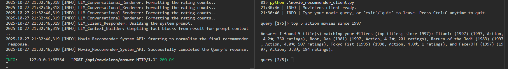

# Movie Recommender System

A conversational AI movie assistant built with **FastAPI**, **SQLite**, and **Large Language Models (LLMs) using meta-llama/Llama-3.2-3B-Instruct with Hugging Face**.  

The system combines structured data retrieval (SQLite) with natural language generation (LLMs) to provide interactive, conversational answers about movies.

---

## Features

- Local **SQLite** database (movies, genres, ratings, cast, director, overview)  
- Dataset ingestion from **MovieLens 100K** or **TMDB 5000**  
- REST API with **FastAPI** and auto-generated docs  
- LLM (meta-llama/Llama-3.2-3B-Instruct) for conversational responses  

---


## System Requirements
- Kaggle account for downloading the Movielens ml-100k dataset.
- Hugging Face Account for LLM - meta-llama/Llama-3.2-3B-Instruct access token
---


## Project Structure

```
movie-recommender-system-01/
│
├── movie_reccommender_system/                          # Core agent logic (intents, LLM orchestration)
└── data_ingestor/                                      # Data Ingestor module
            └── data_raw/                               # Raw datasets (unzipped Kaggle/TMDB files)
            └── data_loader.py                          # load Movielens data for ingestion
            └── db_ingestor.py                          # ingest movielens data into SQLite DB
            └── data_ingestor_main.py                   # driver class for movielens data ingestion 
    ├── db/
        └── movies.db                                   # SQLite database (generated after ingestion)
        └── db_select.py                                # collecting stats for basic EDA (Only for testing).
    ├── query_processor                                 # Query Processor module
        └── query_preprocessing.py                      # query preprocessor
        └── rule_based_parser.py                        # query rule based parser 
        └── query_processor_main                        # driver class for user's query processings
    ├── query_responder                                 # LLM Query Responder module
        └── llm_preprocessing.py                        # preprocessing before LLM inference
    └── llm_context_builder.py                          # context builder before LLM inference
        └── llm_edgecase_handling.py                    # handle the edgecase before LLM inference
        └── llm_conversational_renderer.py              # render conversational tasks before LLM inference
        └── llm_prompt_builder.py                       # LLM prompt builder
        └── llm_cient.py                                # LLM Client for conversation recommender system
    ├── response_basemodel_validator                    # pydantic basemodel validation module
        └── query_response_model.py                     # request/response validation for query processor
        └── llm_response_model.py                        # erequest/respons validation for LLM client
├── tests/                                              # Unittest 
    └── test_data_ingestion                             # TestSuite - data_ingestor module
        └── test_data_loader.py                         # data loader
    └── test_db_ingestor.py                             # db_ingestor
        └── test_data_ingestor_main.py                  # data_ingestor_main
    └── test_query_processor                            # TestSuite - Query processor module
    └── test_query_preprocessing.py                     # quer preprocessing
        └── test_rule_based_parser.py                   # query rule based parser
        └── test_query_processor_main.py                # query_processor main integration
    └── test_query_responder                            # TestSuite - LLM client Repsonder
        └── test_llm_preprocessing_and_context.py       # llm preprocessing & context builder
        └── test_llm_edgecase_handling.py               # llm edgecase handling
        └── test_llm_conversational_renderer.py         # llm conversational renderer
        └── test_llm_prompt_builder.py                  # LLM prompt builder
        └── test_llm_client.py                          # LLM client for conversational inference
├── router/                                             # FastAPI routers (API endpoints)
    └── movie_recommender_sys_router.py                 # Main router - Movielens Recommender Router (POST)
├── app.py                                              # FastAPI entrypoint
├── movie_recommender_client.py                         # CLI client to trigger the Recommender system
├──.gitignore                                           # git system file
├── startup.ps1                                         # Startup script
├── .env                                                # Environment variables (DB path, LLM config, API keys)
├── pyproject.toml                                      # Python dependencies - pkg manager
└── README.md                                           # outline the package details
```

---

## API Endpoints

1.  **Movielens Respnder**
----------------------------

    *   API Endpoint: POST api/movielens/answer
        

2.  **How the system works?**

- Worker 1 (Server Process): Start the FastAPI application using Uvicorn.
```bash
uvicorn app:app --reload
```

- Worker 2 (Client Process): Run the MovieLens recommender system client.
```bash
python .\movie_recommmender_client.py
```

Below is screenshot how the system look like after running: 


Note: Once both workers are active, the client allows 5 interaction attempts. After these attempts are exhausted, the client process terminates automatically. The FastAPI server process continues to run independently.
        

3.  **Sample payload:**
    
    *   { "text": "recommend action movies from 1997" }

    *   { "text": "recommend action movies from 1998", "limit": 5 }

    *   {"text": "recommend action movies from 1997 with rating at least 3"}

    *   {"text": "recommend me romantic comedies between 1997 and 1998 with at least 4 stars"}

    *   {"text": "top 5 action movies since 1997"}

    *   {"text": "can you find top 5 similar movies"}

    *   {"text": "tell me about Godfather"}

    *   {"text": "movies like Inception"}

    *   {"text": "show me top 10 dramas before 1980"}
---


## API Setup Instructions

### 1. Clone the repository
```bash
git clone https://github.com/SurendeKumar/movielens-recommender-system-01
cd movielens-recommender-system-01
```

### 2. Create a virtual environment
```bash
- python -m venv .venv

- Install with editable mode: pip install -e .
- Install with editable mode and also extra dependencies under .dev inside tom file (mainly for testing): pip install -e .[dev]

```

Activate it:

- **macOS/Linux**
  ```bash
  source .venv/bin/activate
  ```
- **Windows (PowerShell)**
  ```powershell
  .venv\Scripts\activate
  ```

### 3. Install dependencies
```bash
pip install -e .
pip install -e .[dev]
```

### 4. Download dataset
- Download **MovieLens 100K** or **TMDB 5000 Movie Dataset** from [Kaggle](https://www.kaggle.com/datasets/prajitdatta/movielens-100k-dataset/data)  
- Unzip the files  
- Place under the folder data_ingestor/data_raw/ -> this is how it should look like -> data_ingestor/data_raw/archive/ml-100k/**files


### 5. Start the FastAPI
```bash
uvicorn app:app --reload
./startup.ps1 (Windows (PowerShell))
sh.startup.sh (macOS) 
```

Note: Copy startup.ps1 as shell script and paste it into startup.sh file.

---


## TestSuite Coverage Highlights

- Detailed explanation about TestSuite can be found here: [unittest TestSuite](https://realpython.com/python-unittest/) 

### Data Ingestion
- data_loader
- db_ingestor
- data_ingestor_main

### Query Processor
- query_preprocessing
- rules_based_parser
- query_processor_main

### LLM Responder
- llm_preprocessing
- llm_context_builder
- llm_edgecase_handling
- llm_prompt_builder
- llm_conversational_renderer
- llm_client


# TestSuite Execution

### Run as individual tests
```bash
# Part 1 – Data Ingestion
python -m unittest discover -s .\tests\test_data_ingestion\ -v
# Part 2 – Query Processor
python -m unittest discover -s .\tests/test_query_processor\ -v
# Part 3 – LLM Responder
python  -m unittest discover -s .\tests/test_query_responder\ -v
```
